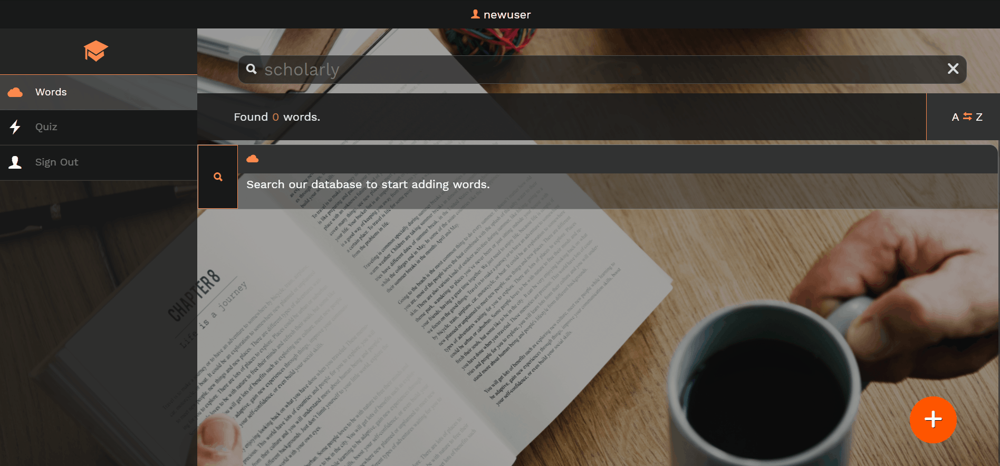
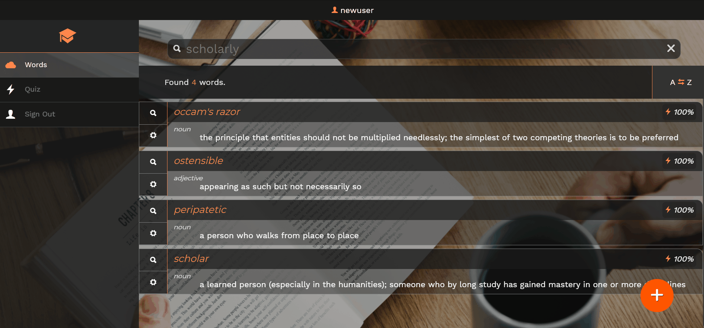
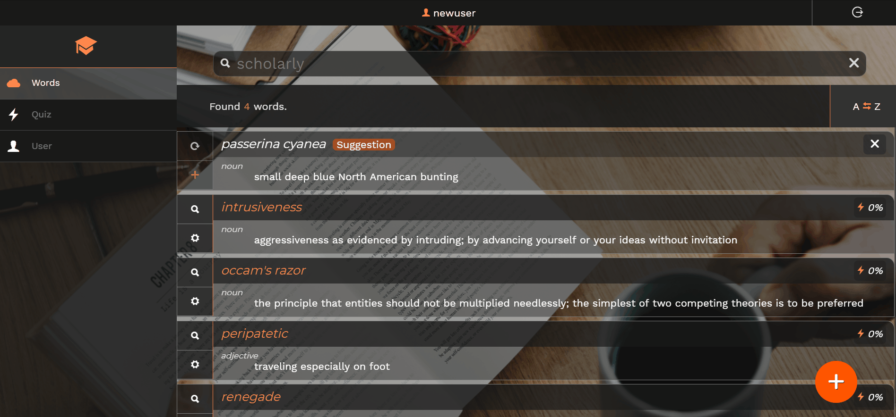
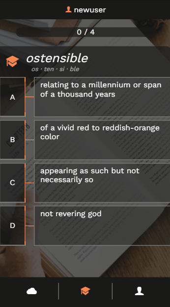

# Scholarly
A web app for mastering your vocabulary.

### Tech
* Angular, Firebase, Authentication

### Features
* Keep a **personalized list** of vocabularly words
* Search a **database** of definitions through **[Words API](https://www.wordsapi.com/docs)**
* Test yourself with short **quizzes** that push the words that escape you most

## Adding Vocab Words Is Easy

Scholarly pulls definitions for your search queries using the **[Words API](https://www.wordsapi.com/docs)**.

Scholarly takes advantage of Words API's word mappings to **make suggestions** to add to your vocabulary **based on what you've already added**.

## Create Your Own Definitions

If Words API definitions aren't sufficient, use the **Edit** tool to **customize your definitions** or create your own entries.

## Add Words, Quiz Yourself, Repeat

You only remember what you're repeatedly exposed to, so use the **Quiz** feature to reinforce that learning.

The quiz **prioritizes words you've got wrong most often** by tracking your results.

View your results at the end of each quiz, repeat the same quiz, or move on to the next one.

## Personalize Your Experience

A couple settings are available to you:
* Change the **quiz length**.
* Turn off **quiz buffering** and Scholarly will only load a quiz when you need one.

## Responsive Design

It's important that users should be able to use Scholarly on the go, so it features a **Mobile-First Responsive Design**.

## Authentication

Scholarly uses **[Firebase Authentication](https://firebase.google.com/docs/auth/)**.
